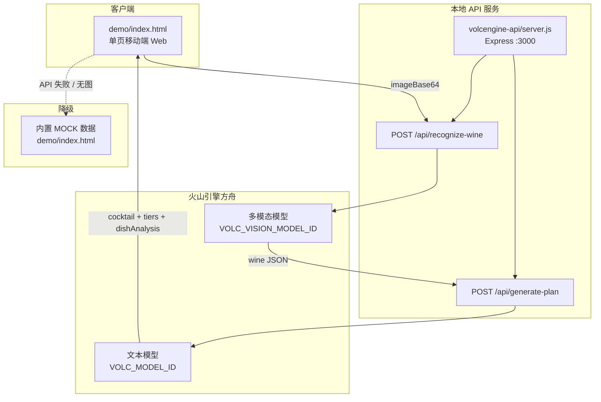

# 金灵酒鬼 MVP 需求书

## 1. 项目概述

### 项目名称

金灵酒鬼

### 一句话定位

**拍一瓶酒，老金帮你识酒、调酒、配菜、组局——像吧台边那位有趣、调皮但特别靠谱的中年师傅，让想试试酒但不太懂的年轻人，也能轻松喝明白、吃明白、局明白。**

### 产品人格：老金（金师傅）

金灵酒鬼不是冷冰冰的百科，也不是 AI 客服。**产品灵魂是一位 45 岁左右、入行 20 年的中年调酒师「老金」**——吧台后的那种人：

| 维度 | 设定 |
|------|------|
| 身份 | 前五星酒店酒吧主管，现「金灵酒鬼」首席酒局顾问 |
| 性格 | 有趣、调皮、爱开玩笑，但说到酒从不糊弄 |
| 说话方式 | 像跟你唠嗑的朋友，偶尔「听叔一句」「这瓶啊，有点意思」；善用比喻，不堆术语 |
| 专业底线 | 看不清的酒标不瞎编；价格只给区间；搭配讲逻辑，不凭感觉忽悠 |
| 对用户 | 默认对方是 22–35 岁、想玩酒但不太懂的小白，耐心、不居高临下 |

**老金出场规则：**

- 结构化字段（酒名、产地、酒精度、价格区间）保持准确、克制
- **个性表达**集中在：`bartenderTake`（识酒点评）、`planName`（方案名）、`flavorNote`、`reason`（配菜理由）、`analysis`（菜品点评）等自然语言字段
- 调皮要有分寸：可以调侃「这瓶别兑雪碧啊」，不能低俗、不能嘲讽用户、不能鼓励酗酒
- 每段个性文案 1–3 句，先给结论再给道理

**语气示例：**

| 场景 | 冷冰冰 ❌ | 老金 ✅ |
|------|----------|--------|
| 识酒 | 本品呈琥珀色，雪莉桶陈酿。 | 瞅这颜色——琥珀得漂亮，雪莉桶养的，入口肯定是果干甜那一挂。 |
| 调酒方案名 | 威士忌曼哈顿变体 | 琥珀暖冬（叔给你调的，冬天喝一口，心里暖和） |
| 配菜 | 油脂与单宁中和。 | 花生米的油香啊，正好托住威士忌的甜，居家局标配，别嫌土，好用。 |
| 小龙虾点评 | 麻辣与果香冲突，不建议。 | 麻辣小龙虾？热闹局行，但麦卡伦那点果香全让你辣没了——实在想吃，叔教你改蒜香版。 |

### 目标用户

- 想买酒试试但不懂选酒的年轻人（22–35 岁）
- 聚会前想快速搞定「喝什么 + 配什么 + 怎么做」的轻度用户
- 愿意分享酒局、邀请朋友一起改酒单/菜单的社交型用户

### 产品边界

- 提供酒类识别参考、调酒灵感、配菜建议、酒馆推荐
- **不是**酒类电商、**不是**医疗营养建议、**不是**价格承诺
- 所有价格均为市场参考区间，需标注数据来源与免责说明
- 未成年人禁止使用；页面需有「适量饮酒」提示

---

## 2. 四大核心功能

### 功能一：AI 拍酒识物（老金看图说话）

用户拍摄酒瓶正面（含酒标清晰）或上传照片。

**识别依据：**
- 酒瓶器型、瓶盖、酒标文字与图案
- 酒体颜色（透明、琥珀、深红等）
- 可见品牌、产区、年份、酒精度等标签信息

**输出结果（JSON 结构化）：**

| 字段 | 说明 |
|------|------|
| 酒名 | 尽量具体到产品名 |
| 酒类 | 白酒/红酒/威士忌/啤酒/清酒等 |
| 产地 | 国家 + 产区（可识别则填） |
| 年份/陈酿 | 标注是否从酒标读取或推断 |
| 酒精度 | 标签可见则填，否则区间估计 |
| 口感 | 甜度、酸度、单宁、醇厚感、刺激感等；`summary` 用消费者能懂的语言 |
| 气味 | 主香型、辅香型（果香/花香/木香/谷物香等） |
| 参考价格 | 单瓶国内市场参考区间（元），注明「仅供参考」 |
| 识别置信度 | 高/中/低；低时提示补拍酒标 |
| 适饮建议 | 适饮温度、杯型、是否适合纯饮或调配 |
| **bartenderTake** | **老金个人点评 1–3 句，有趣但专业，可含比喻/调侃** |
| visibleEvidence | 识酒依据列表，专业可追溯 |

**表达原则：**
- 事实字段只基于图片可见信息，看不清的不硬编
- `bartenderTake` 负责「人味」；`taste.summary` 偏客观，`bartenderTake` 偏主观印象
- 参考价格给区间，不给「官方售价」承诺

**识酒后视觉展示（主体抠图）：**

识别完成后，结果页**不展示用户上传的实拍原图**，而是将酒的主体（酒瓶/酒标）从背景中抠出，以产品详情页风格孤立展示：

| 规则 | 说明 |
|------|------|
| 展示对象 | 酒瓶主体居中，透明底或纯白底，带轻阴影 |
| 布局风格 | LE SOMMELIER 式轻奢产品页：浅灰渐变舞台 + 衬线酒名 + 信息卡 |
| 原图用途 | 用户上传图仅用于 AI 识酒输入；`visibleEvidence` 记录识酒依据，不在主视觉重复展示场景 |
| Demo 实现 | 按酒类匹配预制高清抠图（`麦卡伦.png` / `红酒.png` / `白酒.png`） |
| V1 目标 | 接入图像分割/抠图 API，对实拍酒瓶自动生成透明底主体图 |

---

### 功能二：调酒方案 + 下酒菜搭配（老金开方子）

基于识酒结果，老金生成一套可执行的「酒局方案」。

#### 2.1 调酒方案

包含：
- **方案名称**：有个性的名字（如「琥珀暖冬」「别兑可乐局」），可带副标题 `planSubtitle`
- 调酒方式：纯饮 / 加冰 / 调配鸡尾酒（视酒类而定）
- 材料清单：名称、用量、参考单价、小计
- 工具：雪克壶、吧勺、古典杯等
- 详细步骤：分步编号，每步 1–2 句，老金口吻可适度口语化
- 预估总成本：材料参考价合计
- 难度：入门 / 进阶
- **flavorNote**：为什么这样调——专业逻辑 + 老金一句总结

**调酒页视觉展示（成品抠图）：**

与识酒页一致，调酒方案页主视觉展示**抠出主体的酒杯/成品**（如「琥珀暖冬」古典杯），而非整张吧台场景图。鸡尾酒以透明底酒杯居中呈现；纯饮方案可复用对应酒瓶抠图。

#### 2.2 下酒菜推荐（三档）

| 档位 | 场景 | 老金风格示例 |
|------|------|-------------|
| 平民下酒菜 | 居家、宿舍、便利店凑局 | 「别整那些虚的，花生米卤味管够」 |
| 精致小生活 | 周末小聚、情侣晚餐 | 「周末嘛，芝士盘摆一摆，仪式感有了」 |
| 高端酒局 | 商务、庆祝、仪式感 | 「这瓶配得上和牛，叔不忽悠你」 |

每道菜包含：菜名、**reason**（口感搭配逻辑 + 老金口吻）、预估热量、制作难度、参考成本、简化菜谱。

#### 2.3 用户自定义下酒菜 · 老金点评

用户可输入想吃的菜（如「炸鸡」「麻辣小龙虾」）。

老金从以下维度分析（`analysis` 字段带个性，`tastePairing`/`utility`/`calories` 保持清晰）：
- **口感搭配**：与当前酒/调酒方案的味型是否冲突或互补
- **效用**：解腻、提香、是否压酒味
- **热量**：单份预估 kcal
- **改进建议**：调味、温度、分量、替代菜
- **优化菜谱**：改良版做法（步骤简化）

输出：点评结论 + 推荐等级（强烈推荐 / 可以 / 建议换一道）+ 改良版菜谱 + 可选 `swapSuggestion`（老金推荐换啥）。

---

### 功能三：酒局分享与协作编辑

用户可将「调酒方案 + 下酒菜方案」生成酒局卡片，分享给好友。

**酒局卡片包含：**
- 酒名与识酒摘要 + 老金一句邀请语
- 调酒方案要点
- 下酒菜列表（三档或用户选定档）
- 预估人均费用
- 邀请文案（老金口吻，轻松不尬）

**协作能力（V1.1，Demo 可做 UI 占位）：**
- 好友通过链接进入同一酒局
- 可编辑：材料替换、加一道菜、改步骤备注
- 变更记录：谁改了什么
- 最终确认版酒单/菜单

**今日 Demo 范围：** 生成分享卡片 + 模拟「邀请好友」+ 本地可编辑酒单字段。

---

### 功能四：附近酒馆推荐

为不想在家调酒的用户，推荐附近适合的酒馆。

**推荐逻辑：**
- 基于用户定位（需授权）
- 匹配当前酒的品类（如威士忌吧、红酒餐吧、综合清吧）
- 是否提供同类酒款或经典调酒
- 是否适合当前下酒菜风格（简餐 / 正餐 / 小食）

**展示信息：**
- 店名、距离、人均、评分
- 推荐酒款或招牌调酒
- **reason**：老金口吻推荐理由（1–2 句）
- 一键导航 / 打电话（小程序能力）

**今日 Demo 范围：** Mock 3 家酒馆数据 + 列表 UI，不接真实 LBS。

---

## 3. 用户流程（MVP）

```
打开 App / Demo
  → 拍酒瓶 / 选示例酒
  → 老金识酒（加载文案带人设）→ 识酒结果页（事实 + bartenderTake）
  → 老金调酒方案（个性方案名 + flavorNote）
  → 下酒菜三档 + 自定义菜 → 老金点评
  → 酒局方案总览 / 分享卡
  → 分享邀请好友 / 协作编辑（Demo 占位）
  → 附近酒馆推荐（Mock）
```

---

## 4. 今日 Demo 成功标准

现场演示必须完成：

1. 上传或选择一张酒瓶照片（可用内置示例图）
2. 展示识酒结果（**酒瓶主体抠图** + 口感、气味、年份、产地、参考价格 + **老金点评**）
3. 展示完整调酒方案（**酒杯/成品抠图**、个性方案名、材料、价格、步骤、flavorNote）
4. 展示三档下酒菜 + 用户输入一道菜后的 **老金点评** 与改良菜谱
5. 生成酒局分享卡预览（含老金邀请语）
6. 展示附近酒馆推荐列表（Mock）
7. 全程有「参考价仅供参考」「适量饮酒」提示
8. 整体语气可感受到「有趣调皮但专业」的老金人设

---

## 5. 表达边界

**允许：**
- 基于可见信息的酒类推断
- 市场参考价格区间
- 风味、配菜、调酒科普
- 老金式幽默、比喻、轻度调侃
- 对搭配方案的主观偏好（需说明理由）

**禁止：**
- 保证价格准确、保证年份真伪鉴定
- 治疗效果、解酒医疗建议
- 鼓励过量饮酒、拼酒文化
- 向未成年人推荐
- 低俗、人身攻击、歧视性玩笑
- 用个性文案掩盖事实错误（看不清仍须标 low 置信度）

---

## 6. 视觉方向

- 风格：LE SOMMELIER 式现代轻奢极简——黑白红三色、大圆角、衬线标题、大量留白
- 配色：深黑 `#0A0A0A` + 纯白 `#FFFFFF` + 强调红 `#E63946` + 浅灰 `#F5F5F5`
- 字体：标题衬线（Playfair/Bodoni 感）+ 正文无衬线（Inter/Montserrat 感）
- 人格视觉：老金以**文案人设**呈现，Demo 阶段不做虚拟形象；加载页/结果页可用「老金说」小标签区分个性点评区块
- 详见 `软件界面设计提示词.md`

---

## 7. 技术方案

### 7.1 架构总览



**设计原则：**

- **两步式 AI 流水线**：先视觉识酒（多模态），再文本生成方案（调酒 + 三档下酒菜 + 预设菜品点评），降低单次 Prompt 复杂度，便于分别调参
- **结构化输出**：所有 AI 返回强制 JSON，前端直接渲染，不做自然语言二次解析
- **Mock 兜底**：无网络、无 API Key、识图失败、示例酒款模式时，使用 `demo/index.html` 内置 `MOCK` 对象，保证现场演示不翻车
- **老金人设注入**：通过 System/User Prompt 约束语气，而非前端写死文案

---

### 7.2 技术栈

| 层级 | 选型 | 说明 |
|------|------|------|
| 前端 Demo | 原生 HTML + CSS + JS | 无构建链，今日可交付；`375–390px` 手机壳布局 |
| 本地静态服务 | `npx serve` | 避免 `file://` 导致手机无法跨域调 API |
| API 网关 | Node.js + Express | `volcengine-api/server.js` |
| HTTP 客户端 | axios | 调用火山方舟 Chat Completions |
| 大模型 | 火山引擎方舟 | 视觉识酒 + 文本生成方案 |
| 配置 | dotenv | `.env` 管理 Key 与模型接入点 |
| 协作/分享 Demo | 前端生成 + localStorage | V1.1 再接后端 |
| 酒馆 | 静态 JSON Mock | V1.1 接地图 LBS API |

---

### 7.3 目录与关键文件

```
金灵酒鬼/
├── MVP需求书.md              ← 本文档
├── AI提示词与Mock数据.md      ← Prompt 全文 + Mock JSON + 老金人设规范
├── 软件界面设计提示词.md      ← UI 生图提示词
├── README.md                 ← 运行说明
└── demo/
    └── index.html            ← 可交互 Demo（流程 + MOCK + API 调用）

volcengine-api/
├── server.js                 ← 识酒 / 生成方案 API
├── .env                      ← VOLC_API_KEY, VOLC_MODEL_ID, VOLC_VISION_MODEL_ID
└── package.json
```

---

### 7.4 API 接口规范

#### `POST /api/recognize-wine`

**用途：** 多模态识酒，输出结构化酒款信息 + 老金点评。

**请求：**

```json
{
  "imageBase64": "data:image/jpeg;base64,/9j/4AAQ..."
}
```

**响应：**

```json
{
  "wine": {
    "wineName": "麦卡伦 12 年双雪莉桶",
    "wineType": "单一麦芽威士忌",
    "brand": "Macallan",
    "origin": "苏格兰 · 斯佩塞",
    "vintage": "12 年",
    "abv": "40%",
    "color": "琥珀色",
    "taste": { "sweetness": "", "acidity": "", "tannin": "", "body": "", "finish": "", "summary": "" },
    "aroma": { "primary": [], "secondary": [], "summary": "" },
    "referencePrice": { "min": 480, "max": 650, "currency": "CNY", "note": "国内市场参考区间，仅供参考" },
    "servingTips": "",
    "confidence": "high",
    "visibleEvidence": [],
    "bartenderTake": "瞅这琥珀色，雪莉桶养的没跑了——果干甜、入口柔，别兑可乐啊听叔的。"
  },
  "source": "ai"
}
```

**实现要点：**
- 模型：`VOLC_VISION_MODEL_ID` 或回退 `VOLC_MODEL_ID`（须支持 `image_url` 多模态）
- `temperature: 0.4`，偏稳定识别
- `extractJSON()` 从模型回复中提取 JSON（兼容 markdown 代码块包裹）
- Prompt 见 `AI提示词与Mock数据.md` §1

---

#### `POST /api/generate-plan`

**用途：** 基于识酒 JSON，一次生成调酒方案、三档下酒菜、预设菜品（麻辣小龙虾）老金点评。

**请求：**

```json
{
  "wine": { /* recognize-wine 返回的 wine 对象 */ }
}
```

**响应：**

```json
{
  "cocktail": {
    "planName": "琥珀暖冬",
    "planSubtitle": "叔给你调的，冬天喝一口心里暖和",
    "style": "鸡尾酒",
    "difficulty": "入门",
    "materials": [{ "name": "", "amount": "", "unitPrice": 0, "subtotal": 0 }],
    "tools": [],
    "steps": [],
    "totalCost": 42,
    "flavorNote": ""
  },
  "tiers": {
    "casual": { "label": "平民下酒菜", "dishes": [{ "name": "", "reason": "", "calories": "", "cost": "", "recipe": [] }] },
    "lifestyle": { "label": "精致小生活", "dishes": [] },
    "premium": { "label": "高端酒局", "dishes": [] }
  },
  "dishAnalysis": {
    "麻辣小龙虾": {
      "rating": "可以",
      "ratingClass": "ok",
      "analysis": "",
      "tastePairing": "",
      "utility": "",
      "calories": "",
      "improvedRecipe": { "name": "", "steps": [] },
      "swapSuggestion": ""
    }
  },
  "source": "ai"
}
```

**实现要点：**
- 模型：`VOLC_MODEL_ID`（文本模型即可）
- `temperature: 0.4`（可酌情调至 0.6 增强方案个性）
- 输入为完整识酒 JSON 字符串拼接在 Prompt 后
- Prompt 见 `AI提示词与Mock数据.md` §2–4

---

#### `POST /api/review-dish`（V1.0 规划，Demo 未单独实现）

**用途：** 用户自定义输入菜品后，实时老金点评。

**原因：** Demo 将「麻辣小龙虾」点评随 `generate-plan` 一并生成；自定义菜 V1.0 再拆独立接口，前端调 `POST /api/review-dish` 传入 `{ wine, cocktail, userDish }`。

---

### 7.5 前端 Demo 数据流

```
用户拍照 / 选示例
       ↓
startRecognize()
       ↓
┌─ useRealAI && 有上传图 ─────────────────────────┐
│  1. POST /api/recognize-wine → sessionData.wine │
│  2. POST /api/generate-plan  → cocktail/tiers   │
└─────────────────────────────────────────────────┘
       ↓ 失败或无图
┌─ MOCK[selectedSample] 兜底 ─────────────────────┐
└─────────────────────────────────────────────────┘
       ↓
renderWine() → renderCocktail() → renderFood() → renderShare() → renderBars()
```

**关键变量（`demo/index.html`）：**

| 变量 | 含义 |
|------|------|
| `API_BASE` | URL 参数 `?api=http://电脑IP:3000`，默认 `localhost:3000` |
| `useRealAI` | 是否尝试真实 API（有上传图且 API 可达） |
| `sessionData` | 当前会话识酒 + 方案数据 |
| `MOCK` | whisky / red / baijiu 三套示例数据 |
| `STEPS` | upload → wine → cocktail → food → share → bars |

**手机访问：**

```
http://<电脑IP>:3000/?api=http://<电脑IP>:3000
```

须同时启动 `volcengine-api`（`:3000`）与 `npx serve`（静态页端口，可与 API 同机不同端口）。

---

### 7.6 环境配置

`volcengine-api/.env`：

```env
VOLC_API_KEY=你的方舟API密钥
VOLC_MODEL_ID=ep-xxxxxxxx          # 文本模型接入点
VOLC_VISION_MODEL_ID=ep-xxxxxxxx   # 多模态模型接入点（识酒必填其一）
PORT=3000
```

| 变量 | 必填 | 说明 |
|------|------|------|
| `VOLC_API_KEY` | 是 | 火山方舟 API Key |
| `VOLC_VISION_MODEL_ID` | 识酒必填 | 支持 `image_url` 的多模态接入点 |
| `VOLC_MODEL_ID` | 是 | 文本生成方案；未配视觉时回退识酒（不推荐） |
| `PORT` | 否 | 默认 3000 |

---

### 7.7 Prompt 工程策略（老金人设）

**三层约束：**

1. **角色层**：所有生成类 Prompt 开头注入老金人设（年龄、性格、语气、底线）
2. **任务层**：明确 JSON 字段、识酒事实边界、三档下酒菜结构
3. **示例层**：Mock 数据中的 `bartenderTake`、`flavorNote`、`reason` 作为 few-shot 风格参考（可选拼入 Prompt）

**识酒 Prompt 分工：**

- 事实字段：严格视觉依据，`confidence: low` 时要求用户补拍
- `bartenderTake`：允许主观、幽默，但不得与 `visibleEvidence` 矛盾

**方案 Prompt 分工：**

- `planName`：2–6 字有梗标题 + 可选 `planSubtitle`
- `steps`：可口语化，但必须可执行
- `dishAnalysis.analysis`：老金口吻；`rating` 仍须遵循搭配逻辑

**完整 Prompt 文本：** 见 `AI提示词与Mock数据.md`；服务端常量见 `volcengine-api/server.js` 中 `WINE_PROMPT`、`PLAN_PROMPT`。

---

### 7.8 错误处理与降级

| 场景 | 行为 |
|------|------|
| 无 `imageBase64` | API 400；前端阻止提交 |
| 模型未返回合法 JSON | `extractJSON` 抛错 → 500 |
| 手机访问 API 失败 / CORS | 前端 `catch` → 弹窗说明 → 切换 `MOCK` |
| 仅选示例酒、未拍照 | 直接 `MOCK`，不走 API（Demo 快速路径） |
| 酒标模糊 | AI 标 `confidence: low`；前端展示「建议补拍酒标」 |
| API Key 未配置 | 启动正常，请求时 500；演示用 Mock |

---

### 7.9 安全与合规

- API Key 仅存服务端 `.env`，不进前端、不进仓库
- CORS 当前为 `*`（Demo 便利）；上线须收紧域名
- 图片 Base64 经内存处理，Demo 不落盘；生产需大小限制（已设 `50mb`）、鉴权、频控
- 所有页面页脚：参考价仅供参考、适量饮酒、未成年人禁止

---

### 7.10 部署与演示清单

```bash
# 终端 1：启动 AI 后端
cd volcengine-api && npm start

# 终端 2：启动静态页（端口按 serve 输出为准，示例 3000 或 5173）
cd 金灵酒鬼/demo && npx serve .

# 手机浏览器（同 WiFi）
http://<电脑局域网IP>:<静态端口>/?api=http://<电脑局域网IP>:3000
```

**评委演示建议路径：** 示例酒 Mock 30 秒走完全流程 → 再现场拍一瓶真实酒瓶展示 AI 识酒 + 老金方案。

---

## 8. 版本规划

| 版本 | 产品 | 技术 |
|------|------|------|
| **Demo（今天）** | 老金人设 + 5 步流程 + 分享卡 + 酒馆 Mock | HTML Demo + 火山双 API + Mock 兜底 |
| **V1.0** | 抖音小程序；自定义菜实时点评；老金 loading 文案库 | Taro/uni-app 小程序壳；拆 `review-dish` API；云托管 API |
| **V1.1** | 好友协作编辑、真实 LBS 酒馆 | WebSocket/Supabase 协作；高德/腾讯地图 POI |
| **V1.2** | 酒款收藏、历史酒局、个人口味画像 | 用户体系 + 向量记忆老金偏好 |

---

## 9. 验收对照表

| 需求 | Demo 状态 | 实现位置 |
|------|-----------|----------|
| 拍酒识酒 | ✅ | `POST /api/recognize-wine` + `renderWine()` |
| 老金识酒点评 | ✅ Prompt 已定义；前端待展示 `bartenderTake` 区块 | `AI提示词与Mock数据.md` §1 |
| 调酒方案 | ✅ | `POST /api/generate-plan` → `cocktail` |
| 三档下酒菜 | ✅ | `generate-plan` → `tiers` |
| 麻辣小龙虾点评 | ✅ 随 plan 生成 | `dishAnalysis` |
| 自定义菜点评 | ⏳ UI 有，独立 API V1.0 | 规划 `POST /api/review-dish` |
| 酒局分享卡 | ✅ | `renderShare()` |
| 协作编辑 | 🔲 UI 占位 | localStorage |
| 附近酒馆 | ✅ Mock | `BARS` 常量 |
| 老金人设语气 | ✅ Prompt 层 | `server.js` + `AI提示词与Mock数据.md` |
